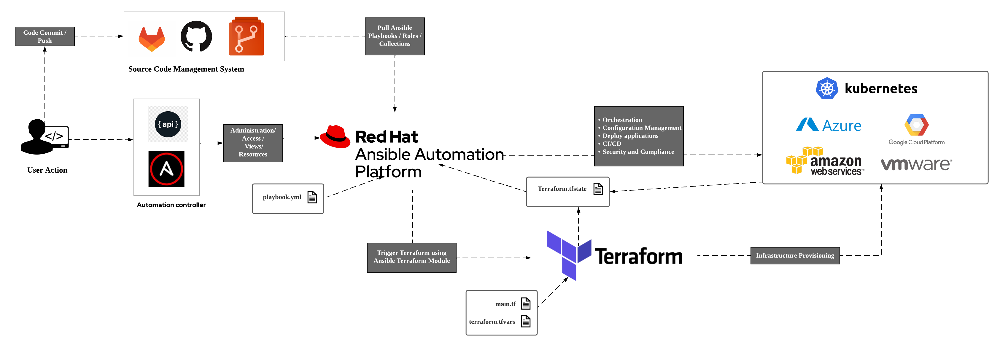

# Overview

Ansible Automation Platform 2 (AAP2) + Terraform is a project created by ASA Red hat Colombia to provide Ansible students with a project that allows them to build a playbook stream where the following is done:
- IaC stage with (Terraform)
- Inventory verification stages (Ansible)
- NodeJS (Ansible) application deployment stage
- Stage to functional tests of the application. (Ansible)
Note: all tested to work on AZURE and AWS public clouds.

Usage
---------

1. Enter the AAP2 URL provided by the instructor.
2. Create an execution environment for terraform via the following container image: quay.io/mpalacio_redhat_com/terraform_ee
3. Create new credentials for AZURE or AWS in AAP2.
4. create new credentials for the git repository if it is private (optional)
5. Create new credentials for the VM created in AZURE or AWS in AAP2:
  - user: ansible
  - Password: PasswordRedhat-123! 
7. Create an inventory named Azure Inventory or AWS Inventory.
8. Within the created inventory, there is a tab called source: create one called Azure Source or AWS Source by entering the            previously created cloud credentials and the following parameters suggested in the following image.
9. Create a project called: Ansible-Terraform where the following repository link will be entered:                                     https://github.com/mpalacio2583/terrafom_cloud.git
10. create the following job template:

  - Terraform IaC. 
    - Inventory: Azure Inventory or AWS Inventory
    - Project: Ansible-Terraform 
    - Execution Environment: Terraform
    - Playbook: Terraform_Azure.yml or  Terraform_AWS.yml
    - Credential: Azure or AWS

  - Check Inventory.
    - Inventory: Azure Inventory or AWS Inventory
    - Project: Ansible-Terraform 
    - Execution Environment: Terraform
    - Playbook: add_host_to_Controller_inventory.yml
    - Credential: Controller Credential

  - Install_tomcat.
    - Inventory: Azure Inventory or AWS Inventory
    - Project: Ansible-Terraform 
    - Execution Environment: Ansible Engine 2.9 
    - Playbook: install_tomcat.yml
    - Credential: SSH VM and Cloud (azure or AWS)
    - Options: Privilege Escalation

  - webapp_validation.
    - Inventory: Azure Inventory or AWS Inventory
    - Project: Ansible-Terraform 
    - Execution Environment: Ansible Engine 2.9 
    - Playbook: webapp_validation.yml
    - Credential: SSH VM
    - Options: Privilege Escalation
    
11. Create New Workflow Template
  - Name: Flow Ansible-Terraform and Organization: Default
    -  Start button to begin.
      -  select the job template "Terraform IaC" and save.
      -  On the box "Terraform IaC" select the plus sign, then select On Success and select the job template "Check Inventory" and          save.
      -  On the box "Check Inventory" select the plus sign, then select On Success and select the job template "Install_tomcat"             and save.
      -  On the box "Install_tomcat" select the plus sign, then select On Success and select the job template "webapp_validation"             and save.
    -  Save the workflow.
    -  Create Survey:
      -  Name: Resource_Group and Answer variable name: resource_group
      -  Name: Vm_Name and Answer variable name: vm_name

12. run the workflow and observe the results.

AUTHOR
------
Mauricio Palacio E mpalacio@redhat.com
